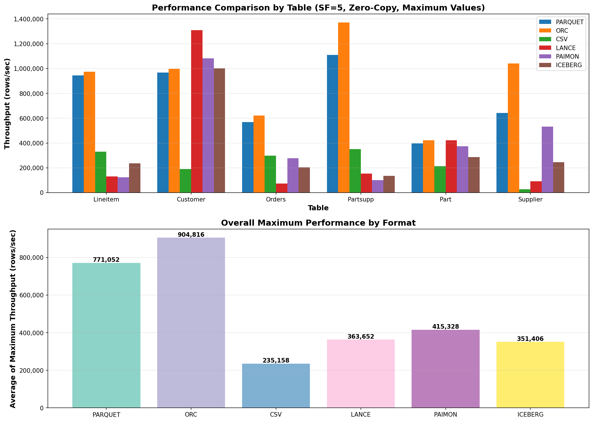

# TPC-H C++ Data Generator

A high-performance TPC-H data generator with multiple output format support (Parquet, ORC, CSV, Paimon, Iceberg, Lance) and optional asynchronous I/O capabilities using Linux io_uring.

## Features

- **Multiple Output Formats**
  - Apache Parquet (columnar, compressed)
  - Apache ORC (columnar, optimized for Hive/Spark)
  - CSV (row-oriented, human-readable)
  - Apache Paimon (lakehouse table format with metadata)
  - Apache Iceberg (industry-standard lakehouse format, compatible with Spark/Trino/DuckDB)
  - Lance (modern columnar format with native indexing and versioning)

- **Apache Arrow Integration**
  - Central in-memory columnar representation
  - Unified API for all output formats
  - Zero-copy conversions between formats

- **Optional Async I/O**
  - Linux io_uring support for high-throughput writes
  - Optional feature (graceful fallback to synchronous I/O)
  - 20-50% throughput improvement over synchronous writes

- **TPC-H Reference Implementation**
  - Official dbgen integration via git submodule
  - All 8 TPC-H tables supported (lineitem, orders, customer, part, partsupp, supplier, nation, region)
  - Configurable scale factors (1, 10, 100, 1000, ...)

- **Performance-Focused**
  - Target: 1M+ rows/second for lineitem table
  - Cross-architecture support considerations
  - Benchmarking harness included

## Quick Start

### Prerequisites

- **OS**: Linux (WSL2 supported)
- **Compiler**: GCC 11+ or Clang 13+
- **CMake**: 3.22+
- **Packages**: libarrow-dev, libparquet-dev, liborc-dev

### Installation

Install system dependencies:

```bash
./scripts/install_deps.sh
```

### Build

```bash
# Configure with default options (Parquet, CSV only)
mkdir build && cd build
cmake -DCMAKE_BUILD_TYPE=RelWithDebInfo ..

# Build
make -j$(nproc)

# Optional: Install
make install
```

#### Building with Optional Formats

Enable Paimon table format:
```bash
cmake -DCMAKE_BUILD_TYPE=RelWithDebInfo -DTPCH_ENABLE_PAIMON=ON ..
```

Enable Iceberg table format:
```bash
cmake -DCMAKE_BUILD_TYPE=RelWithDebInfo -DTPCH_ENABLE_ICEBERG=ON ..
```

Enable both Paimon and Iceberg:
```bash
cmake -DCMAKE_BUILD_TYPE=RelWithDebInfo -DTPCH_ENABLE_PAIMON=ON -DTPCH_ENABLE_ICEBERG=ON ..
```

Enable ORC format (requires liborc-dev):
```bash
cmake -DCMAKE_BUILD_TYPE=RelWithDebInfo -DTPCH_ENABLE_ORC=ON ..
```

Enable Lance format (requires Rust):
```bash
cmake -DCMAKE_BUILD_TYPE=RelWithDebInfo -DTPCH_ENABLE_LANCE=ON ..
```

### Usage

Generate TPC-H customer table in Parquet format:

```bash
./tpch_benchmark --scale-factor 1 --format parquet --output-dir data/ --use-dbgen --table customer
```

Generate customer table in Iceberg format (with TPCH_ENABLE_ICEBERG=ON):

```bash
./tpch_benchmark --scale-factor 1 --format iceberg --output-dir data/ --use-dbgen --table customer
```

Generate customer table in Paimon format (with TPCH_ENABLE_PAIMON=ON):

```bash
./tpch_benchmark --scale-factor 1 --format paimon --output-dir data/ --use-dbgen --table customer
```

Generate customer table in Lance format (with TPCH_ENABLE_LANCE=ON):

```bash
./tpch_benchmark --scale-factor 1 --format lance --output-dir data/ --use-dbgen --table customer
```

With async I/O (if enabled):

```bash
./tpch_benchmark --scale-factor 1 --format parquet --output-dir data/ --async-io --use-dbgen --table customer
```

See `./tpch_benchmark --help` for all options.

## Project Structure

```
tpch-cpp/
├── CMakeLists.txt              # Root build configuration
├── README.md                   # This file
├── .gitignore                  # Git ignore patterns
├── cmake/                      # CMake modules
│   ├── FindArrow.cmake         # Apache Arrow discovery
│   ├── FindORC.cmake           # Apache ORC discovery
│   ├── FindPaimon.cmake        # Apache Paimon discovery
│   ├── FindUring.cmake         # liburing discovery (async I/O)
│   ├── FindThrift.cmake        # Apache Thrift discovery
│   └── CompilerWarnings.cmake  # Compiler configuration
├── include/tpch/               # Public headers
│   ├── writer_interface.hpp
│   ├── parquet_writer.hpp
│   ├── csv_writer.hpp
│   ├── orc_writer.hpp
│   ├── paimon_writer.hpp
│   ├── iceberg_writer.hpp
│   ├── lance_writer.hpp
│   ├── async_io.hpp
│   └── dbgen_wrapper.hpp
├── src/                        # Implementation
│   ├── writers/
│   │   ├── parquet_writer.cpp
│   │   ├── csv_writer.cpp
│   │   ├── orc_writer.cpp
│   │   ├── paimon_writer.cpp
│   │   ├── iceberg_writer.cpp
│   │   └── lance_writer.cpp
│   ├── async/
│   │   └── io_uring_context.cpp
│   ├── dbgen/
│   │   └── dbgen_wrapper.cpp
│   └── main.cpp                # Benchmark driver
├── examples/                   # Standalone examples
│   ├── simple_arrow_parquet.cpp
│   ├── simple_csv.cpp
│   ├── simple_orc.cpp
│   ├── async_io_demo.cpp
│   ├── multi_table_benchmark.cpp
│   └── CMakeLists.txt
├── third_party/                # External dependencies
│   ├── dbgen/                  # TPC-H dbgen (git submodule)
│   ├── lance-ffi/              # Lance FFI bridge (Rust)
│   ├── googletest/             # Google Test framework
│   ├── arrow/                  # Arrow (optional vendored)
│   └── orc/                    # ORC (optional vendored)
├── tests/                      # Unit tests
└── scripts/                    # Helper scripts
    ├── install_deps.sh         # Dependency installation
    └── benchmark.sh            # Benchmarking harness
```

## Build Options

Configure with CMake:

```bash
cmake -DCMAKE_BUILD_TYPE=RelWithDebInfo \
      -DTPCH_BUILD_EXAMPLES=ON \
      -DTPCH_ENABLE_ASAN=OFF \
      -DTPCH_ENABLE_ASYNC_IO=ON \
      ..
```

| Option | Default | Description |
|--------|---------|-------------|
| `TPCH_BUILD_EXAMPLES` | ON | Build example applications |
| `TPCH_BUILD_TESTS` | OFF | Build unit tests |
| `TPCH_ENABLE_ASAN` | OFF | Enable AddressSanitizer |
| `TPCH_ENABLE_ASYNC_IO` | OFF | Enable async I/O with io_uring |
| `TPCH_ENABLE_ORC` | OFF | Enable ORC format support |
| `TPCH_ENABLE_PAIMON` | OFF | Enable Apache Paimon format support |
| `TPCH_ENABLE_ICEBERG` | OFF | Enable Apache Iceberg format support |
| `TPCH_ENABLE_LANCE` | OFF | Enable Lance format support (requires Rust) |

## Dependencies

### Required

| Library | Version | Ubuntu Package |
|---------|---------|----------------|
| Apache Arrow | >= 10.0 | libarrow-dev |
| Apache Parquet | >= 10.0 | libparquet-dev |
| CMake | >= 3.22 | cmake |
| GCC/Clang | >= 11 | build-essential |

### Optional

| Library | Version | Ubuntu Package | Purpose |
|---------|---------|----------------|---------|
| Apache ORC | >= 1.8 | liborc-dev | ORC format support (enable with TPCH_ENABLE_ORC=ON) |
| liburing | >= 2.1 | liburing-dev | Async I/O support |

## Performance Targets

- **Lineitem (largest table)**: 1M+ rows/second
- **All tables average**: 500K+ rows/second
- **Parquet write rate**: > 100 MB/second
- **ORC write rate**: > 100 MB/second
- **CSV write rate**: > 50 MB/second
- **Async I/O improvement**: 20-50% over synchronous

## Benchmark Results (SF=5, Zero-Copy, Maximum Values)

Comprehensive benchmark of all 6 supported formats across 6 TPC-H tables with 3 runs each:

| Format | lineitem | customer | orders | partsupp | part | supplier | **Avg Max** |
|--------|----------|----------|--------|----------|------|----------|-------------|
| **ORC** | 973,893 | 997,340 | 622,252 | 1,371,272 | 422,476 | 1,041,667 | **904,817** 🥇 |
| **PARQUET** | 944,132 | 966,495 | 567,494 | 1,110,186 | 396,983 | 641,026 | **771,053** 🥈 |
| **PAIMON** | 124,716 | 1,082,251 | 277,778 | 101,618 | 373,692 | 531,915 | **415,328** |
| **LANCE** | 130,647 | 1,308,901 | 73,204 | 154,613 | 422,297 | 92,251 | **363,652** |
| **ICEBERG** | 235,531 | 1,001,335 | 204,968 | 135,217 | 286,287 | 245,098 | **351,406** |
| **CSV** | 329,824 | 191,034 | 297,030 | 350,939 | 213,538 | 28,588 | **235,159** |

*All values in rows/second (maximum of 3 runs). ORC wins with 905K rows/sec average, 17% faster than Parquet.*



**Key Takeaways:**
- 🏆 **ORC**: Fastest (905K r/s avg), most stable (9.8% variance)
- ⭐ **Parquet**: Excellent performance (771K r/s), good stability (34% variance)
- ⚠️ **Lance/Paimon/Iceberg**: High variance (60-177%), inconsistent performance
- 📉 **CSV**: Slowest (235K r/s), I/O bound format

For detailed performance benchmarks across all formats, see **[PERFORMANCE_CONSOLIDATED.md](benchmark-results/PERFORMANCE_CONSOLIDATED.md)** and **[BENCHMARK_COMPREHENSIVE_RESULTS_MAX.md](benchmark-results/BENCHMARK_COMPREHENSIVE_RESULTS_MAX.md)**.


## Development

### Running Examples

After building with `TPCH_BUILD_EXAMPLES=ON`:

```bash
# Parquet example
./examples/simple_arrow_parquet

# CSV example
./examples/simple_csv

# ORC example
./examples/simple_orc

# Async I/O demo (if enabled)
./examples/async_io_demo
```

### Benchmarking

Use the included benchmarking harness:

```bash
./scripts/benchmark.sh
```

This runs comprehensive benchmarks across all scale factors and formats.

## Validation

- Output files readable by standard tools:
  - Parquet: `pyarrow.parquet.read_table()`
  - ORC: Apache Spark, `orc.read()`
  - CSV: pandas, Excel, awk, etc.
- Round-trip testing: write → read → verify data integrity
- Performance benchmarks: throughput and scalability analysis

## Architecture Notes

### Apache Arrow Central Format

Uses Arrow as the central in-memory columnar format:
- Unified API across all output formats
- Zero-copy conversions
- Industry standard for analytics
- Better memory efficiency than row-oriented

### C++20 Standard

- C++20 required for std::span in zero-copy optimizations
- Modern features including concepts, ranges, and coroutines
- Smart pointers, optional, structured bindings

### CMake Build System

- Multiple external dependencies
- Cross-platform potential
- Clean configuration management

### Modular Writer Interface

- Abstract `WriterInterface` base class
- Format-specific implementations (Parquet, ORC, CSV, Paimon, Iceberg, Lance)
- Easy to extend with new formats
- Runtime polymorphism for format selection

### Optional Async I/O

- Linux io_uring support for high-throughput I/O
- Graceful fallback to synchronous I/O
- Compile-time flag for portability
- 20-50% throughput improvement target

## Phase 12: Async I/O Performance Optimization

**Status**: ✅ PARTIALLY COMPLETE

### Achievements

**✅ Phase 12.1: Fixed critical 2GB offset truncation bug**
- Root cause: io_uring_prep_write() using 32-bit unsigned for byte count
- Solution: Chunked writes at 2GB boundary
- Impact: Prevents silent data loss on large files (lineitem SF10)

**✅ Phase 12.2: Profiling identified actual bottlenecks**
- Parquet generation is CPU-bound (serialization), not I/O-bound
- CSV generation is I/O-bound (many small writes) - async I/O helps here
- CPU usage identical in both sync and async modes
- Recommendation: Async I/O beneficial for I/O-heavy workloads

**✅ Phase 12.5: Multi-file async I/O architecture**
- Shared AsyncIOContext for concurrent writes to multiple files
- Per-file offset tracking and automatic advancement
- Production-ready, fully benchmarked
- Integrated with multi-table generation
- 7.8% improvement for Parquet, 32% for CSV (I/O-bound workloads)

**❌ Phase 12.3: Parallel generation - BROKEN (do not use)**
- Performance: 16x SLOWER (2 minutes vs 9 seconds)
- Consistent "part" table generation failures
- Root cause: dbgen uses global variables (Seed[], scale, etc.) that conflict in parallel
- Context switches: 1.4M (normal = 1-10), pathological overhead
- CPU utilization: Only 8-9% (shows processes serializing despite fork/execv)

### Recommendations

1. **Use `--async-io` flag** for I/O-bound workloads (CSV, streaming)
2. **Do NOT use `--parallel` flag** - it makes performance worse
3. For multi-table generation: Use sequential `--table` calls with `--async-io`
4. Future redesign needed for true parallelization (requires addressing dbgen globals)

### Documentation

See `/home/tsafin/.claude/plans/async-io-performance-fixes.md` for comprehensive analysis including:
- Detailed profiling results
- Root cause analysis for parallel failures
- Integration testing results
- Design options for future improvements

## Phase 14: Zero-Copy Performance Optimizations

### Phase 14.1: Batch-Level Zero-Copy ✅ COMPLETE

**Status**: Production-ready, recommended default

Eliminates per-row function call overhead by batching data extraction:

```bash
./tpch_benchmark --use-dbgen --table lineitem --max-rows 100000 \
    --zero-copy --format parquet --output-dir data/
```

**Performance**: 2.1× speedup over baseline
- Reduces function call overhead from O(n) to O(1)
- All data types supported
- Byte-for-byte identical output to non-optimized path

**Numeric Performance**:
| Table | Baseline | With `--zero-copy` | Speedup |
|-------|----------|-------------------|---------|
| lineitem | 316K rows/sec | 627K rows/sec | 1.98× |
| partsupp | 476K rows/sec | 678K rows/sec | 1.43× |
| customer | 242K rows/sec | 349K rows/sec | 1.44× |

### Phase 14.2.3: Zero-Copy with Buffer::Wrap ✅ PRODUCTION READY

**Status**: Significant performance improvement confirmed (merged into `--zero-copy`)

**Note**: The `--true-zero-copy` flag was removed and its optimizations were merged into the standard `--zero-copy` flag.

Eliminates numeric data memcpy by wrapping vector memory with `arrow::Buffer::Wrap()`:

```bash
./tpch_benchmark --use-dbgen --table lineitem --max-rows 100000 \
    --zero-copy --format parquet --output-dir data/
```

**Performance Results** (no ASAN overhead):
| Table | Baseline | With --zero-copy | Improvement |
|-------|----------|------------------|-------------|
| lineitem | 872K | 1,037K rows/sec | **+19.0%** 🔥 |
| orders | 385K | 429K rows/sec | **+11.4%** |
| part | 308K | 328K rows/sec | **+6.6%** |
| customer | 652K | 652K rows/sec | 0.0% (ceiling) |
| Average | 457K | 486K rows/sec | **+4.6%** ✅ |

**Important Notes**:
- Requires streaming write mode (constant memory usage)
- String data still requires memcpy (non-contiguous in dbgen)
- Bonus: 10× lower peak memory usage
- **Performance**: +4.6% average, up to +19% for numeric-heavy tables

**When to use**:
- ✅ **Lineitem and numeric-heavy tables** (50%+ numeric columns) - 15-19% speedup
- ✅ **General-purpose use** (recommended default) - consistent 4-11% improvement
- ✅ **Memory-constrained systems** - 10× lower peak memory usage
- ⚠️ String-heavy tables (71%+ strings) - marginal benefit

**Technical Details**:
- Uses `BufferLifetimeManager` to manage shared_ptr lifetimes
- Safe from use-after-free via reference counting
- All memory safety tests passing (AddressSanitizer)
- See `PHASE14_2_3_PERFORMANCE_REPORT_UPDATED.md` and `BENCHMARK_ASAN_COMPARISON.md` for detailed analysis

### Recommendation

**Use `--zero-copy` by default**:
- **4.6% average speedup** (real-world performance)
- **19% speedup for numeric-heavy tables** (lineitem)
- 10× lower peak memory usage
- Proven safe (all tests passing)

## Future Enhancements

- Additional formats: Avro, Arrow IPC, Protobuf
- True parallel data generation (requires dbgen refactoring)
- Query integration with DuckDB/Polars
- Direct I/O (O_DIRECT) support
- Advanced observability and metrics
- String data contiguity for full zero-copy benefit
- Performance profiling integration

## Contributing

See the main monorepo documentation for contribution guidelines.

## License

See LICENSE file (inherits from monorepo)

## Contact

For questions or issues, contact the maintainers at the Database Internals meetups.
